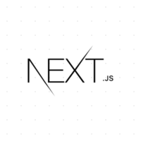
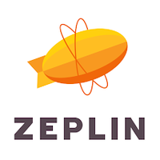
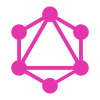

# Portfolio
Samsung Software Academy For Youth(SSAFY)에서 교육을 수료 했고, Web 풀스택 개발을 지향하고 있습니다.
Typescript, React, Mobx, Next, Webpack을 활용한 프론트엔드 개발과 Java, Spring boot, Mysql, Express를 활용한 백엔드 개발에 관심이 많습니다.

## 개발스택
### Frontend
<!--

 
-->

### Backend
<!-- 

  
-->

 

### etc

 

<!-- 

-->

### Project (클릭시 해당 git으로 연결)
* [소개띵 (중고거래 PWA)](https://github.com/RyuIL/sogaething-master)
* [Prolog (블로그 플랫폼 반응형 웹)](https://github.com/RyuIL/prolog-master)

### 활동
* [Samsung Software Academy](https://www.ssafy.com/ksp/jsp/swp/swpMain.jsp)

